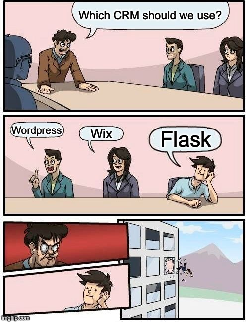

# Flask Blog




The application starts with a simple blog where users can input new posts. Each post consists of a title and the content. The main page, `/blog`, displays all the posts that have been created. There is a generic renderer for handling requests. This renderer takes a page name as an argument and tries to render a template with that name. If the template doesn't exist, it returns a 404 error. This approach provides flexibility in adding new pages to the application. There is also a route for creating new posts at `/new-post`. The application redirects the user to the main blog page to display the new post.

### Installation:

1. Start by cloning the repo using the following command:

```bash
$ git clone https://github.com/gaytomycode/flask-blog.git
```

2. Then move to the project working directory:

```bash
$ cd flask-blog
```

3. Install the required python dependencies:

```shell
$ pip install -r requirements.txt
```

### Usage:

Start the Flask application by executing the following command:

```bash
$ cd blog
$ flask
```

After the server starts successfully, open a web browser and navigate to `http://localhost:5000/` to view the application.

### Future Plans:

Nothing.  While this application serves as a simple blog and demonstrates the use of Flask, its primary purpose is to showcase high-quality code. The code adheres to best practices for readability, maintainability, and scalability. It's designed to be a reference for those seeking to understand how to write clean, efficient, and testable code.

## Developing

For any further development on this project, please make sure that the existing application functions as expected. Run the suite of unit tests to verify this:

```bash
pytest --cov
```

This will report which tests pass and which tests fail. Make sure all current tests pass before adding new features.

If you add any new features, please also create appropriate unit tests.

The tests provide full coverage for the application. They ensure that:
- The main page can be accessed successfully.
- The about page can be accessed successfully.
- The blog page shows the correct no posts message when there are no posts.
- The user can create a new post.
- In circumstances where a post is created without a title or content, the application includes default values.
- The blog page correctly displays all the posts.
- In cases of a non-existing route, the application returns a 404 error.

## Contributing

Contributions to this project are welcome! Please fork this repository and open a Pull Request to propose your changes.

## License

This project is licensed under the Creative Commons Attribution-NonCommercial-ShareAlike 4.0 International License. See the `LICENSE.md` file for full license text.
